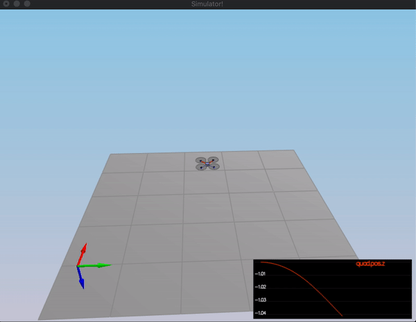
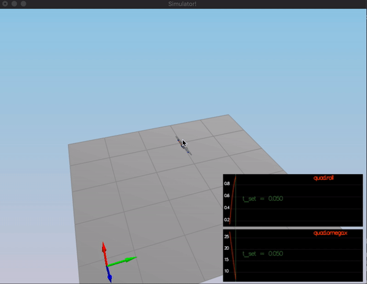
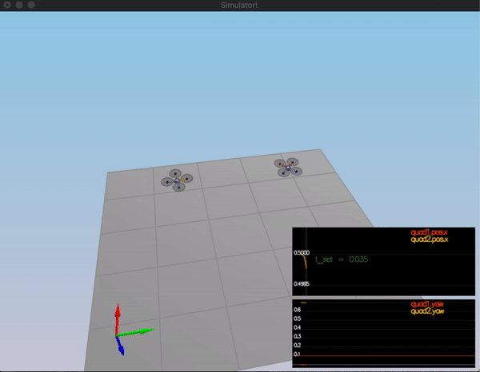
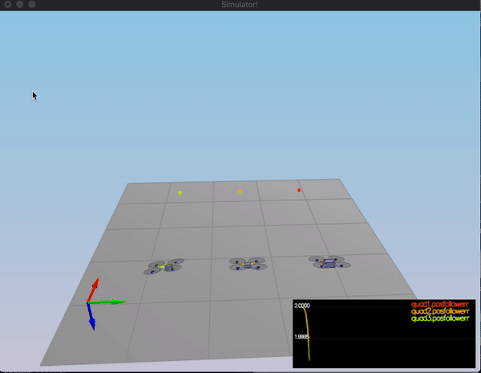
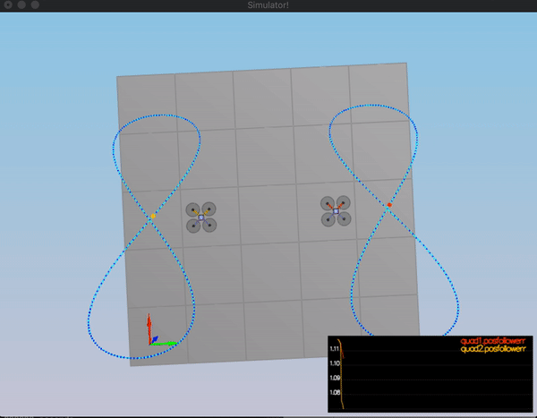

# Control of a 3D Quadrotor #

## Contents ##

 - [Introduction](#introduction)
 - [The Goal of this Project](#the-goal-of-this-project)
 - [Files and Directories](#files-and-directories)
 - [Tasks](#tasks)
    - [Body rate control in C++](#1.-implemented-body-rate-control-in-c++)
    - [Roll pitch control in C++](#2.-implement-roll-pitch-control-in-c++)
    - [Altitude controller in C++](#3.-implement-altitude-controller-in-c++)
    - [Lateral position control in C++](#4.-implement-lateral-position-control-in-c++)
    - [Yaw control in C++](#5.-implement-yaw-control-in-c++)
    - [Calculating the motor commands in C++](#6.-implement-calculating-the-motor-commands-given-commanded-thrust-and-moments-in-c++)
 - [Flight Evaluation](#flight-evaluation)
    - [Intro](#scenrio-1---intro)
    - [Attitude Control](#scenario-2-–-attitude-control)
    - [Position Control](#scenario-3-–-position-control)
    - [Nonidealities](#scenario-4-–-nonidealities)
    - [Trajectory Follow](#scenario-5-–-trajectory-follow)
 
 ## Introduction ##
 
This is the writeup for the C++ control project. Development environment setup and 
configuration details can be found in 
[The C++ Project Readme.](https://github.com/udacity/FCND-Controls-CPP) 


## The Goal of this Project ##

In the real world the flight controller is usually implemented in C or C++. 
So in this project we implement a 3D quadrotor controller in C++. The code we
wrote here can eventually be transferred to a real drone!

## Files and Directories ##

`src/QuadControl.cpp`: This is the C++ implementation of the controller.

`config/QuadControlParams.txt`: This file contains the configuration for the controller.

`animations`: This directory contains successful run results for each scenario.


## Tasks ##

### 1. Implemented body rate control in C++ ###

The controller should be a proportional controller on body rates to commanded moments. 
The controller should take into account the moments of inertia of the drone when 
calculating the commanded moments.

This implementation is addressed in `BodyRateControl()` function which has the 
following signature `V3F QuadControl::BodyRateControl(V3F pqrCmd, V3F pqr)`.
It takes desired body rates and estimated body rates parameters as input and outputs 
desired moments for each of the three axis (x, y, z). 

We calculate the desired moments for each of the 3 axes as follows 
```momentCmd = I * kpPQR * (pqrCmd - pqr)``` where `I` stands for moments of inertia 
in V3F format. The error for body rates is calculated as `(pqrCmd - pqr)` where 
`pqrCmd` and `pqr` stands for desired body rates and current/estimated body rates 
in `rad/s` respectively.

### 2. Implement roll pitch control in C++ ###

The controller should use the acceleration and thrust commands, in addition 
to the vehicle attitude to output a body rate command. The controller should 
account for the non-linear transformation from local accelerations to body rates. 
Note that the drone's mass should be accounted for when calculating the target angles.

This implementation is addressed in `RollPitchControl()` function which has
 the following signature `V3F QuadControl::RollPitchControl(V3F accelCmd, 
 Quaternion<float> attitude, float collThrustCmd)`.
It takes desired acceleration in global XY coordinates, current or estimated 
attitude of the vehicle, and desired collective thrust and outputs the 
desired pitch and roll rates.

We converted `collThrustCmd` force to acceleration as follows: 
`float c = -collThrustCmd / mass` first then computed the desired pitch and roll 
rates. Yaw rate is left at its default value, 0. We also constrained desired pitch 
and roll rates in `[-maxTiltAngle, maxTiltAngle]` range.
 
### 3. Implement altitude controller in C++ ###

The controller should use both the down position and the down velocity to command 
thrust. Ensure that the output value is indeed thrust (the drone's mass needs to be 
accounted for) and that the thrust includes the non-linear effects from non-zero 
roll/pitch angles. Additionally, the C++ altitude controller should contain an 
integrator to handle the weight non-idealities presented in scenario 4.

This implementation is addressed in `AltitudeControl()` function which has the 
following signature `float QuadControl::AltitudeControl(float posZCmd, float velZCmd, 
float posZ, float velZ, Quaternion<float> attitude, float accelZCmd, float dt)`.
 
It takes desired and current vertical positions and velocities, feed-forward 
vertical acceleration, and the time step of the measurements then outputs a 
collective thrust command.

The C++ altitude controller's integrator is implemented as `i_term` to handle the 
weight non-idealities presented in scenario 4. During the implementation vertical 
speeds are constrained in `[-maxAscentRate, maxDescentRate]` range.
 
### 4. Implement lateral position control in C++ ###

The controller should use the local NE position and velocity to generate a commanded 
local acceleration.

This implementation is addressed in `LateralPositionControl()` function which has the 
following signature `V3F QuadControl::LateralPositionControl(V3F posCmd, V3F 
velCmd, V3F pos, V3F vel, V3F accelCmdFF)`.

It takes desired and current position and velocity and feed-forward acceleration 
as input and outputs the desired horizontal accelerations with the Z component 0.
We constrain the horizontal velocity and acceleration in `[-maxSpeedXY, maxSpeedXY]` 
and `[-maxAccelXY, maxAccelXY]` respectively. We also add desired acceleration to the
result of our controller as follows `accelCmd += kpVelXY * velErr;`.

### 5. Implement yaw control in C++ ###

The controller can be a linear/proportional heading controller to yaw rate commands
(non-linear transformation not required).

This implementation is addressed in `YawControl()` function which has the following 
signature `float QuadControl::YawControl(float yawCmd, float yaw)`.

It takes commanded yaw and current yaw then outputs a desired yaw rate. We unwrapped 
a radian angle measure yawErr to range `[yawErr, 2. * F_PI)]` as follows: 
`float yawErr = fmodf(yawCmd - yaw, 2. * F_PI);` then used the yaw control gain 
parameter kpYaw to compute the desired yaw rate.

### 6. Implement calculating the motor commands given commanded thrust and moments in C++ ###

The thrust and moments should be converted to the appropriate 4 different desired 
thrust forces for the moments. Ensure that the dimensions of the drone are properly 
accounted for when calculating thrust from moments.

This implementation is addressed in `GenerateMotorCommands()` function which has the following 
signature `VehicleCommand QuadControl::GenerateMotorCommands(float collThrustCmd, V3F momentCmd)`.

It takes desired collective thrust and desired rotation moment about each axis as inputs 
and converts a desired 3-axis moment and collective thrust command to individual motor 
thrust commands and sets the class member variable `cmd` accordingly. 

We also constrain motor thrust forces in `[minMotorThrust, maxMotorThrust]` range. 


## Flight Evaluation ##

Your C++ controller is successfully able to fly the provided test trajectory and 
visually passes inspection of the scenarios leading up to the test trajectory.
Ensure that in each scenario the drone looks stable and performs the required task. 
Specifically check that the student's controller is able to handle the non-linearities 
of scenario 4 (all three drones in the scenario should be able to perform the required 
task with the same control gains used).

### Scenrio 1 - Intro ###

<p align="center">

</p>

### Scenario 2 – Attitude Control ###

<p align="center">

</p>

### Scenario 3 – Position Control ###

<p align="center">

</p>

### Scenario 4 – Nonidealities ###

<p align="center">

</p>

### Scenario 5 – Trajectory Follow ###

<p align="center">

</p>
