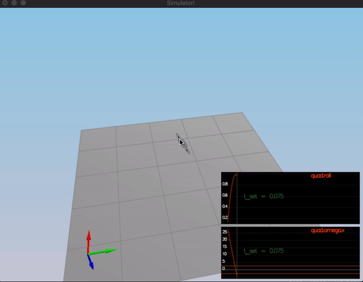

# Control of a 3D Quadrotor #

## Contents ##

 - [Introduction](#introduction)
 - [Implementation Files and Results](#implementation-files-and-results)
 - [Tasks](#tasks)
    - [Implemented body rate control in C++](#1.-implemented-body-rate-control-in-c++)
    -  
 - [Flight Evaluation](#flight-evaluation)
    - [Intro](#scenrio-1---intro)
    - [Attitude Control](#scenario-2-–-attitude-control)
    - [Position Control](#scenario-3-–-position-control)
    - [Nonidealities](#scenario-4-–-nonidealities)
    - [Trajectory Follow](#scenario-5-–-trajectory-follow)
 
 ## Introduction ##
 
This is the writeup for the C++ control project. Development environment setup and configuration details can be found in [The C++ Project Readme.](https://github.com/udacity/FCND-Controls-CPP) 

## Files and Directories ##

`src/QuadControl.cpp`: This is the C++ implementation of the controller.

`config/QuadControlParams.txt`: This file contains the configuration for the controller.

`animations`: This directory contains successful run results for each scenario.


## Tasks ##

### 1. Implemented body rate control in C++ ###

The controller should be a proportional controller on body rates to commanded moments. 
The controller should take into account the moments of inertia of the drone when calculating the commanded moments.

This implementation is addressed in `BodyRateControl()` function which has the following signature `V3F QuadControl::BodyRateControl(V3F pqrCmd, V3F pqr)`.
It takes desired body rates and estimated body rates parameters as input and outputs desired moments for each of the three axis (x, y, z). 

We calculate the desired moments for each of the 3 axes as follows 
```momentCmd = I * kpPQR * (pqrCmd - pqr)``` where `I` stands for moments of inertia in V3F format. 
The error for body rates is calculated as `(pqrCmd - pqr)` where `pqrCmd` and `pqr` stands for desired body rates and current/estimated body rates in `rad/s` respectively.

### 2. Implement roll pitch control in C++ ###

The controller should use the acceleration and thrust commands, in addition 
to the vehicle attitude to output a body rate command. The controller should
 account for the non-linear transformation from local accelerations to body rates.
 Note that the drone's mass should be accounted for when calculating the target angles.

This implementation is addressed in `RollPitchControl()` function which has
 the following signature `V3F QuadControl::RollPitchControl(V3F accelCmd, 
 Quaternion<float> attitude, float collThrustCmd)`.
It takes desired acceleration in global XY coordinates, current or estimated 
attitude of the vehicle, and desired collective thrust and outputs the 
desired pitch and roll rates.

We converted `collThrustCmd` force to acceleration as follows `-collThrustCmd / mass` first
then computed the desired pitch and roll rates. Yaw rate is left at its default value, 0. 
We also constrained desired pitch and roll rates in `[-maxTiltAngle, maxTiltAngle]` range.
 
### 3. Implement altitude controller in C++ ###

The controller should use both the down position and the down velocity to command thrust. 
Ensure that the output value is indeed thrust (the drone's mass needs to be accounted for) 
and that the thrust includes the non-linear effects from non-zero roll/pitch angles. 
Additionally, the C++ altitude controller should contain an integrator to handle the weight 
non-idealities presented in scenario 4.


### 4. Implement lateral position control in C++ ###

### 5. Implement yaw control in C++ ###

### 6. Implement calculating the motor commands given commanded thrust and moments in C++ ###


## Flight Evaluation ##

Your C++ controller is successfully able to fly the provided test trajectory and visually passes inspection of the scenarios leading up to the test trajectory.
Ensure that in each scenario the drone looks stable and performs the required task. Specifically check that the student's controller is able to handle the non-linearities of scenario 4 (all three drones in the scenario should be able to perform the required task with the same control gains used).

### Scenrio 1 - Intro ###

<p align="center">

</p>

### Scenario 2 – Attitude Control ###

<p align="center">

</p>

### Scenario 3 – Position Control ###

<p align="center">

</p>

### Scenario 4 – Nonidealities ###

<p align="center">

</p>

### Scenario 5 – Trajectory Follow ###

<p align="center">

</p>
